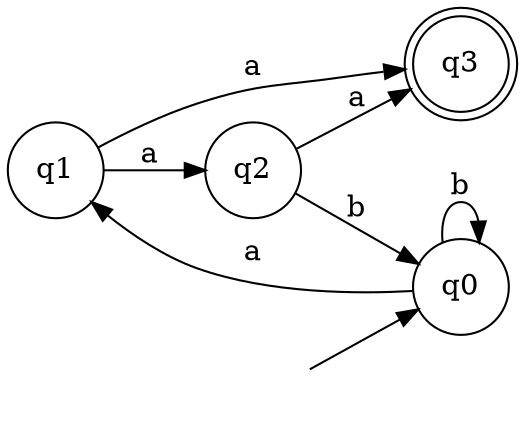
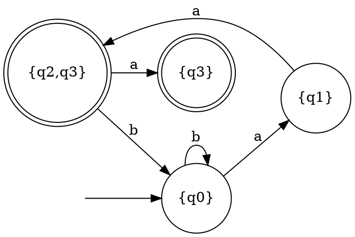

# Laboratory Work #2 - Determinism in Finite Automata, NDFA→DFA, Chomsky Hierarchy

**Course:** Formal Languages & Finite Automata
**Variant:** 5
**Student:** Daniil Cerneaga
**Group:** FAF-243

---

## Objectives

1. Understand what an automaton is and what it can be used for.
2. Provide a function in the Grammar class that classifies the grammar based on the Chomsky hierarchy.
3. Implement conversion of a finite automaton to a regular grammar.
4. Determine whether the given FA is deterministic or non-deterministic.
5. Implement the conversion algorithm from NDFA to DFA.
6. Represent the finite automaton graphically (bonus).

---

## Automaton Specification

**Variant 5:**
```
Q  = {q0, q1, q2, q3}     // States
Σ  = {a, b}               // Alphabet
F  = {q3}                 // Final states
q0 = q0                   // Initial state

Transition function (δ):
    δ(q0, a) = q1
    δ(q0, b) = q0
    δ(q1, a) = q2          // same (state, symbol) — two targets → NDFA
    δ(q1, a) = q3          //
    δ(q2, a) = q3
    δ(q2, b) = q0
```

This automaton is **non-deterministic** because δ(q1, a) maps to two different states simultaneously: q2 and q3.

---

## Implementation

### 1. Grammar Class (`grammar.py`)

Extends the Grammar class from Lab 1 with a `classify_chomsky()` method that walks the production rules and determines the grammar type. It checks for right-linear form (A → aB or A → a) and left-linear form (A → Ba or A → a) to identify Type 3, then checks that each LHS is a single non-terminal for Type 2, then compares lengths of left- and right-hand sides for Type 1, and defaults to Type 0 otherwise.

The helper methods `_is_right_linear()` and `_is_left_linear()` support multi-character non-terminal names (e.g. `q0`, `q1`) by trying all possible split points in the RHS string rather than assuming fixed one-character symbols.

### 2. Finite Automaton Class (`finite_automaton.py`)

Stores the FA as a transition dictionary in NDFA format where each key (state, symbol) maps to a list of target states. This naturally represents both DFA (lists of length 1) and NDFA (lists of length > 1).

`to_regular_grammar()` converts the automaton to a right-linear regular grammar. Each state becomes a non-terminal. Each transition δ(qi, a) = qj produces the rule `qi → a qj`. An additional terminal rule `qi → a` is added whenever qj is a final state (since we can stop there).

`is_deterministic()` iterates over all transition entries and returns False as soon as any (state, symbol) pair maps to more than one state.

`to_dfa()` implements the subset construction algorithm. It treats sets of NDFA states as single DFA states, performs a BFS from the start set {q0}, and at each step computes the union of all transitions reachable from the current set under each input symbol. A DFA state is marked final if it contains at least one NDFA final state.

`to_dot()` returns a Graphviz DOT string for visual rendering (bonus).

### 3. Main Program (`main.py`)

Demonstrates all tasks in sequence: prints the original NDFA and its transition table, converts it to a regular grammar and classifies it, checks determinism, runs the subset construction and prints the resulting DFA table, validates the same set of strings against both NDFA and DFA to confirm equivalence, and finally prints DOT strings for both automata.

---

## How to Run

**Requirements:** Python 3.8+
```bash
python3 main.py
```

**Expected output:**
1. Lab 1 grammar structure and Chomsky classification
2. Original NDFA structure and transition table
3. Equivalent regular grammar from FA and its classification
4. Determinism check result with the non-deterministic transition identified
5. Full DFA transition table after subset construction
6. String validation results comparing NDFA and DFA (must be identical)
7. Graphviz DOT strings for both NDFA and DFA (bonus)

---

## Results

### Task 2a — Chomsky Classification

The Lab 1 Grammar (Variant 5) is classified as **Type 3 – Regular Grammar**.

All productions are right-linear: every rule is either of the form `A → aB` (terminal followed by non-terminal) or `A → a` (pure terminal). This satisfies the definition of a right-linear regular grammar.

```
S → bS   (A → aB form)
S → aF   (A → aB form)
S → d    (A → a  form)
F → cF   (A → aB form)
F → b    (A → a  form)
L → aL   (A → aB form)
L → c    (A → a  form)
```

### Task 3a — FA to Regular Grammar

Applying the conversion rules to Variant 5 produces the following grammar:
```
q0 → a q1  |  b q0
q1 → a q2  |  a q3  |  a
q2 → a q3  |  a  |  b q0
```

Terminal rules `q1 → a` and `q2 → a` are added because q3 is a final state, meaning reaching q3 from q1 or q2 on symbol `a` is also a valid termination.

Chomsky classification of the resulting grammar: **Type 3 – Regular Grammar**

### Task 3b — Determinism Check

The transition δ(q1, a) has two targets: q2 and q3. Since a single (state, symbol) pair leads to more than one state, the automaton is **non-deterministic (NDFA)**.

```
Non-deterministic transition: δ(q1, a) = [q2, q3]
```

### Task 3c — Subset Construction: NDFA → DFA

Each row represents a DFA super-state (a set of NDFA states) and its transitions.

| DFA State      | a       | b     | Final? |
|----------------|---------|-------|--------|
| {q0} (start)   | {q1}    | {q0}  | No     |
| {q1}           | {q2,q3} | —     | No     |
| {q2,q3}        | {q3}    | {q0}  | **Yes** |
| {q3}           | —       | —     | **Yes** |

The resulting DFA has **4 states**. Final states are any super-state that contains q3, namely {q2,q3} and {q3}.

The non-determinism at δ(q1, a) forces the creation of the super-state {q2, q3}. Since q3 is already inside it, {q2, q3} is immediately a final state.

### String Validation

All strings were tested against both NDFA and DFA with identical results, confirming correctness of the subset construction.

| String  | Expected | NDFA   | DFA    |
|---------|----------|--------|--------|
| `aa`    | Accept   | ✓      | ✓      |
| `aaa`   | Accept   | ✓      | ✓      |
| `baa`   | Accept   | ✓      | ✓      |
| `baaa`  | Accept   | ✓      | ✓      |
| `aabaa` | Accept   | ✓      | ✓      |
| `b`     | Reject   | ✓      | ✓      |
| `a`     | Reject   | ✓      | ✓      |
| `ab`    | Reject   | ✓      | ✓      |
| `ba`    | Reject   | ✓      | ✓      |
| `bb`    | Reject   | ✓      | ✓      |

---

## Project Structure

```
laboratory-work-2/
├── grammar.py              # Grammar class with Chomsky classifier
├── finite_automaton.py     # FiniteAutomaton class with all conversions
├── main.py                 # Main execution script
└── README.md               # This file
```

---

## Conversion Process: NDFA → DFA

The subset construction works by treating every possible *set* of NDFA states as a single DFA state. Starting from {q0}, for each input symbol the algorithm computes the union of all states reachable from every member of the current set. If that union has not been seen before, it becomes a new DFA state and is added to the processing queue. The process ends when no new sets are discovered. A DFA state is accepting if and only if at least one of its component NDFA states was accepting.

The key insight for Variant 5 is that the non-determinism at δ(q1, a) forces the creation of the super-state {q2, q3}. Because q3 ∈ F, this super-state is immediately final — meaning any path reaching q2 under the NDFA is now simultaneously treated as possibly reaching q3 as well.

---

## Chomsky Hierarchy

The classifier in `grammar.py` handles all four grammar types:

| Type | Name | Rule form checked |
|------|------|-------------------|
| 3 | Regular | A → aB or A → a (right-linear), A → Ba or A → a (left-linear) |
| 2 | Context-Free | Single non-terminal on LHS |
| 1 | Context-Sensitive | \|LHS\| ≤ \|RHS\| for all productions |
| 0 | Unrestricted | No restrictions |

---

## Bonus — Graphviz DOT Output

Both automata can be visualized by pasting the DOT output into [Graphviz Online](https://dreampuf.github.io/GraphvizOnline/).

**NDFA (Variant 5):**


**DFA after subset construction:**


---

## Conclusions

1. ✅ Chomsky classifier correctly identifies right-linear grammars as Type 3 and handles multi-character non-terminal names for generic use.
2. ✅ FA-to-grammar conversion produces a valid right-linear regular grammar from Variant 5, also classified as Type 3.
3. ✅ The automaton is confirmed non-deterministic due to δ(q1, a) = {q2, q3}.
4. ✅ Subset construction produces a correct 4-state DFA that accepts exactly the same language as the original NDFA.
5. ✅ Graphviz DOT output provides visual confirmation of both automata structures.

The core takeaway is that non-determinism adds expressive convenience during modeling but not expressive power — every NDFA can always be converted to an equivalent DFA. In Variant 5 the state count stays the same (4 states in both) because the non-determinism only produces one new super-state {q2, q3} while {q1, q2, q3} never gets created.

---

## References

Course materials: "Formal Languages & Finite Automata" by Cretu Dumitru and Vasile Drumea, Irina Cojuhari.
Hopcroft, J. E., Motwani, R., Ullman, J. D. (2006). *Introduction to Automata Theory, Languages, and Computation*. Pearson.

---

**Date:** February 2026
**Repository:** [GitHub Link]
